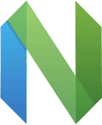

<h1 align="center">AbacatePay Theme 🥑</h1>

<p align="center">A green-first theme crafted for AbacatePay and modern development workflows.</p>

<p align="center">
  
</p>

<p align="center">
  <sub>
    <samp>
      Font · <a href="https://www.jetbrains.com/lp/mono/">JetBrains Mono</a><br/>
      Theme · <a href="https://marketplace.visualstudio.com/items?itemName=abacatepay.abacatepay-theme">AbacatePay Dark Theme</a>
    </samp>
  </sub>
</p>

<h2 align="center">Match the Theme with your System</h2>

<p align="center">To match the theme with your system (auto-switching between light and dark modes), add the following configuration to your `.vscode/settings.json`</p>

```jsonc
{
    "window.autoDetectColorScheme": true,
    "workbench.preferredDarkColorTheme": "AbacatePay Theme Dark",
    "workbench.preferredLightColorTheme": "AbacatePay Theme Light",
}
```

<h2 align="center">Use in your favorite editors</h2>

<p align="center">Select your favorite editor to view the instructions and start using AbacatePay Theme.</p>

<p align="center">
  <a href="docs/NEOVIM.md">
    
  </a>
  &nbsp;&nbsp;&nbsp;&nbsp;
  <a href="docs/INTELLIJ.md">
    
  </a>
</p>

<p align="center">
  <a href="docs/NEOVIM.md"><b>Neovim</b></a>
  &nbsp;&nbsp;&nbsp;&nbsp;
  <a href="docs/INTELLIJ.md"><b>IntelliJ</b></a>
</p>

<br/>

<p align="center">
  Originally created by
  <em><a href="https://github.com/almeidazs">almeida</a></em>
  and
  <em><a href="https://github.com/albuquerquesz">albuquerque</a></em>
</p>
